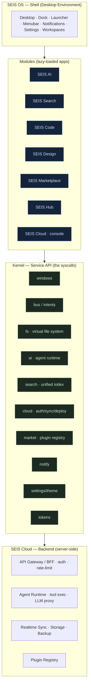
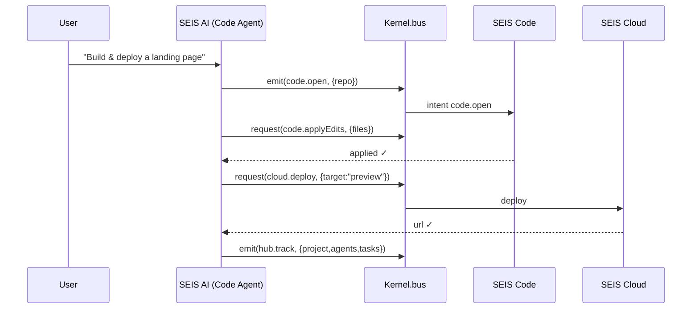
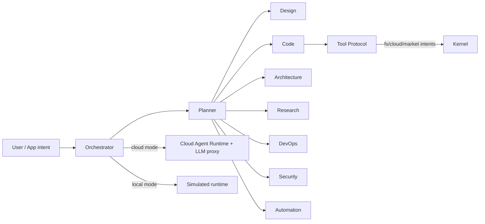

# SEIS OS — System Architecture

> **Status:** Foundational architecture (design phase — pre-implementation).
> **Author role:** Lead Architect / Principal Engineer.
> **Scope:** The complete SEIS AI‑Native Creative Operating System: SEIS OS, AI, Search,
> Code, Design, Marketplace, Cloud, Hub — designed to feel like **one product**.

This document is the canonical architecture. It is intentionally produced **before any OS
code** so that structure, contracts and sequencing are agreed first. It contains no
placeholder scaffolding; every module here has a defined responsibility, a public surface
and a place in the build order.

---

## 1. What SEIS is — and is not

SEIS is an **integrated, AI‑native creative operating system that runs in the browser**: a
windowing **shell** hosting eight first‑class **applications** over a small **kernel of
services** (the "syscalls"), unified by **one design system** and **one AI agent runtime**.

It is **not** a chatbot, a dashboard, a website, a VS Code clone, a Linux clone, a prompt
collection, or an API wrapper. Those are *features of modules*, never the product.

The product thesis — *everything feels like one product* — is enforced by three shared
singletons every module depends on and none may bypass:

1. **One kernel** (windows, processes, event/intent bus, virtual FS, persistence).
2. **One design system** (tokens → primitives → patterns; dark‑first, AA‑accessible).
3. **One intelligence layer** (the agent runtime + unified search index).

---

## 2. Architectural model

A four‑layer, capability‑gated architecture. Apps never talk to each other directly or to
infrastructure directly — they call **kernel services**, which is what makes modules
swappable, plugins safe, and the experience coherent.



**Why this model (and not the obvious alternatives):**

- *Not* a folder of independent SPAs glued by links — that fragments state, auth, theme and
  AI context. A **single shell + kernel** keeps one session, one store, one look.
- *Not* a monolith — modules are **lazy‑loaded, sandboxed apps** so the OS boots fast and
  third‑party plugins can be the *same shape* as first‑party apps.
- **Capability‑based service access**: an app/plugin receives only the kernel services it
  declares and the user grants. This is the security spine (see §10).

---

## 3. Key technical decisions (with alternatives)

| # | Decision | Recommendation | Alternatives considered | Rationale |
|---|----------|----------------|-------------------------|-----------|
| **D1** | Language & build | **TypeScript + Vite** workspace for the OS | Stay vanilla/no‑build (current showcase apps) | An 8‑module OS *requires* code‑splitting, lazy module loading and typed service contracts. Standalone showcases (`vscode-web`, gacha, video‑hero) **stay** vanilla. |
| **D2** | UI/runtime | **Lit (Web Components) + a ~1KB signals store** | React, Svelte, Solid, pure DOM | Shadow DOM gives *real* per‑app encapsulation (the "process boundary"); signals give fine‑grained reactivity without a framework runtime. Svelte is the fallback if the team prefers SFCs. |
| **D3** | Design system | Extend **`packages/design-tokens` + `packages/ui`** (already in repo) | New library | Reuse what exists; promote tokens to the single source of truth (CSS vars + typed exports). |
| **D4** | Persistence | **IndexedDB (local‑first) + Cloud sync engine** | LocalStorage, server‑only | Local‑first = instant, offline‑capable; sync reconciles to Cloud. Matches the `vscode-web` IndexedDB pattern already shipped. |
| **D5** | AI provider | **Claude API** via a **server‑side proxy**, with a **local simulated mode** when no key | Client‑side keys, single model | Keys never touch the client. No backend? Degrade to the simulated REPL mode already proven in `apps/vscode-web`, so demos always work. |
| **D6** | Backend | **Cloud adapters** behind one interface (Supabase / Convex / Vercel) | Hard‑wire one vendor | The repo already references these; an adapter seam keeps Cloud swappable and testable with a mock. |
| **D7** | Plugins | **Capability‑manifest + sandboxed iframe/worker** | `eval` plugin code in‑page | Untrusted plugin code must not get ambient access to FS/AI/Cloud. Manifest declares needs; kernel brokers. |

> **Ratification gate:** D1/D2 change the repo's current no‑build ethos for the OS subtree.
> These are the decisions to confirm or override before Phase 0.

---

## 4. Monorepo structure

Builds on the existing `apps/` + `packages/` layout; adds `modules/` (the eight apps) and
`services/` (the Cloud backend). Existing packages are reused, not replaced.

```
seis/
├── apps/
│   ├── seis-os/                  # ★ the Shell / desktop environment (the OS entrypoint)
│   │   ├── src/
│   │   │   ├── kernel/           # boot · window-manager · process model · bus · registry
│   │   │   ├── shell/            # desktop · dock · launcher · menubar · notifications · settings
│   │   │   ├── services/         # client-side service clients (ai/search/cloud/market/fs)
│   │   │   ├── runtime/          # app loader · lifecycle · sandbox host
│   │   │   └── main.ts
│   │   ├── index.html · vite.config.ts
│   ├── vscode-web/  shanhaijing-gacha/  video-hero/    # existing standalone showcases (unchanged)
│   └── android/ macos/ web/ fullstack/                  # existing platform lanes
├── modules/                      # the 8 SEIS apps — each a lazy-loaded workspace package
│   ├── seis-ai/        # agent console, multi-agent orchestration UI
│   ├── seis-search/    # unified search UI + intent router
│   ├── seis-code/      # productionized IDE (absorbs apps/vscode-web)
│   ├── seis-design/    # design systems · components · tokens · wireframes · prototypes
│   ├── seis-marketplace/
│   ├── seis-cloud/     # cloud console (storage/deploy/monitor surfaces)
│   └── seis-hub/       # command center
├── packages/                     # shared platform SDK (★ = already in repo)
│   ├── kernel-sdk/     # types + thin client for kernel services (apps import this)
│   ├── ui/             ★ design-system components (Web Components)
│   ├── design-tokens/  ★ color/type/space/motion tokens → CSS vars + TS
│   ├── core/           ★ shared rules / platform contracts
│   ├── data/           ★ persistence: IndexedDB + sync engine + schema/migrations
│   ├── asset-registry/ ★ media/asset references
│   ├── ai-core/        # agent orchestrator · agent defs · tool protocol · streaming
│   ├── search-core/    # index · query parser · intent router · providers
│   └── cloud-adapters/ # supabase/convex/vercel behind one interface (+ mock)
├── services/                     # SEIS Cloud — backend
│   ├── gateway/        # API gateway / BFF · auth · rate-limit
│   ├── agent-runtime/  # server-side agent execution · tool exec · LLM proxy (keys live here)
│   ├── sync/           # realtime sync · storage · backup
│   └── registry/       # marketplace plugin registry
└── docs/architecture/seis-os-architecture.md   # (this document)
```

---

## 5. The Kernel — service API ("syscalls")

Every capability an app needs is a kernel service. Apps receive a **scoped** handle; the
kernel enforces grants. This single table is the contract the whole OS is built against.

| Service | Surface (illustrative) | Used by |
|---|---|---|
| `windows` | `open(appId, props) · focus · close · tile · snapshot()` | shell, all apps |
| `bus` | `emit(intent, payload) · on(intent, cb) · request(intent)→Promise` | all (inter‑module intents) |
| `fs` | `read · write · list · watch · mkdir · remove` (virtual, synced) | Code, Design, Search, AI |
| `ai` | `spawn(agentId, task) · stream(cb) · tool(name,args) · cancel` | AI, Code, Design, Hub |
| `search` | `query(text, scope) · index(doc) · suggest(text)` | Search, launcher, all |
| `cloud` | `auth() · storage · deploy(target) · sync.status()` | Cloud, Code, Hub |
| `market` | `list · install · remove · update · grants(pluginId)` | Marketplace, kernel |
| `notify` | `post(level,msg,actions) · clear` | all |
| `settings` | `get · set · theme(mode) · observe` | shell, all |
| `tokens` | `var(name) · scheme · motion(prefersReduced)` | all (via design system) |

**Window/Process model:** each open app instance is a *process* with id, lifecycle
(`mount→focus→suspend→dispose`), its own state slice, and a capability set. Suspended
windows release rAF/timers (the perf rule proven in `video-hero`). Workspaces are named
sets of window layouts, persisted and Cloud‑synced.

**Intent bus = the "one product" glue.** Cross‑module actions are *intents*, not imports:



---

## 6. Module specifications

Each module is a workspace package that exports a standard `App` interface
(`{ id, title, icon, capabilities[], mount(host, kernel) }`) and is lazy‑loaded by the
launcher.

- **SEIS OS (shell)** — Desktop, window system, dock, app launcher, file manager (over
  `fs`), terminal, notifications, settings, workspace manager, system monitor. Owns boot,
  auth handoff, theme, and the capability broker.
- **SEIS AI** — Multi‑agent console. Orchestrator + seven agent definitions (Design, Code,
  Architecture, Research, DevOps, Security, Automation), each a system‑prompt + tool set +
  guardrails. Streams replies and tool calls; can drive any app via intents. Modes:
  **cloud** (server runtime) / **local** (simulated, no keys).
- **SEIS Search** — One index, seven scopes (AI, Web, Code, Docs, Projects, Plugins,
  Files). An **intent router** classifies the query and routes the result’s "open" action to
  the right app. ⌘K is available system‑wide from the shell.
- **SEIS Code** — Productionizes `apps/vscode-web`: Monaco, terminal, Git/GitHub & PRs via
  `cloud`, workspace explorer over `fs`, live Preview, and the **AI Pair Programmer** (Code
  Agent) for multi‑file editing.
- **SEIS Design** — Design systems, components, tokens (reads/writes `packages/design-tokens`),
  wireframes, prototypes, brand kits, motion concepts. **Design→Code** exports
  components/tokens via intent.
- **SEIS Marketplace** — Install/remove/update plugins; AI‑aware and user‑created plugins.
  Plugins ship a capability manifest; the kernel brokers grants and sandboxes execution.
- **SEIS Cloud** — Console over the backend: sync, storage, deployment, **agent runtime**,
  backup, monitoring. The only path to secrets and server compute.
- **SEIS Hub** — Global command center: active projects, agents, tasks, notifications,
  system health, resource usage — aggregated from the bus + a telemetry service.

---

## 7. Design system

Dark‑mode‑first, Apple‑grade restraint. **Tokens → Primitives → Patterns.**

- **Tokens** (`packages/design-tokens`): a single source emitting **CSS custom properties**
  and **typed TS exports** — color (semantic, not raw), type scale, spacing scale, radius,
  elevation, and **motion** (durations, easings, `prefers-reduced-motion` variants).
- **Primitives** (`packages/ui`, Web Components): window chrome, button, field, menu, list,
  dialog, toast, command‑palette, segmented control, panel, resizer.
- **Patterns**: app frame, split view, inspector, results list, agent stream.
- **Principles enforced in review**: strong typography, premium spacing, motion *with
  purpose* (no decorative motion), AA contrast, full keyboard operability, responsive down
  to tablet. **Anti‑bloat budget:** a new dependency requires an ADR.

---

## 8. Data, persistence & sync

**Local‑first.** Authoritative working state lives in IndexedDB; a sync engine reconciles to
Cloud for continuity and backup.

- **Stores:** `fs` (virtual files), `workspaces` (window layouts), `settings`, `agents`
  (runs/history), `search-index`, `marketplace` (installed + grants), `kv`.
- **Sync engine** (`packages/data`): change‑log + last‑writer‑wins per record with vector
  clocks for conflict surfacing; offline queue; resumes on reconnect → multi‑device
  continuity.
- **Migrations:** versioned, forward‑only, run on boot.

---

## 9. AI architecture



- **Orchestrator** plans a task into agent steps, runs them with streaming and tool calls,
  and writes progress to Hub.
- **Agents** = definition (role prompt) + tool allow‑list + guardrails. Tools are exposed as
  **kernel intents**, so an agent can only do what the *app/user capabilities* permit — the
  same broker as plugins.
- **Modes:** *cloud* (keys + execution server‑side via `services/agent-runtime`) and *local*
  (deterministic simulated streaming + tool effects — the pattern already shipped in the
  `vscode-web` Claude REPL), so the system is always demoable.

---

## 10. Security model

- **Capability‑based access:** apps and plugins declare needed services; the kernel grants a
  scoped handle; the user can review/revoke in Settings.
- **Plugin isolation:** untrusted plugin code runs in a **sandboxed iframe/worker**;
  all access is message‑brokered (no ambient FS/AI/Cloud).
- **Secrets never on the client:** all model/provider keys live in `services/agent-runtime`;
  the client holds only short‑lived session tokens from `cloud.auth`.
- **Surface hygiene:** CSP, rate‑limiting at the gateway, signed plugin manifests, audit log
  surfaced in Hub.

---

## 11. Key user flows

1. **Boot → Desktop:** load → boot → `cloud.auth` (or guest/local) → desktop with dock and
   the last workspace’s windows restored.
2. **AI‑driven build:** Launcher → AI → *"Build a landing page"* → Architecture Agent plans →
   Design Agent generates components (opens Design) → Code Agent scaffolds (opens Code) →
   Preview → `cloud.deploy` → Hub shows project/agents/tasks.
3. **Unified search:** ⌘K → query → tabbed results → Enter opens in the correct app via the
   intent router.
4. **Plugin install:** Marketplace → install → kernel registers app/agent/commands → appears
   in Launcher/Dock with reviewed grants.
5. **Code + AI pair:** Code → open repo → Pair Programmer → multi‑file edit → Git/PR via
   `cloud`→GitHub.
6. **Continuity:** work persists locally and syncs; resume on another device.
7. **Hub control:** monitor/pause/resume agents; watch health and resource usage.

---

## 12. Performance & accessibility budgets

- **Boot:** shell interactive < 1.5 s on mid hardware; modules **lazy‑loaded** on first open.
- **Per‑app budget:** initial module chunk ≤ 150 KB gzip; suspended windows release timers/rAF.
- **Runtime:** 60 fps interactions; virtualization for long lists/trees; main‑thread work
  chunked.
- **Accessibility:** WCAG **AA**, keyboard‑first, visible focus, managed focus traps in
  windows/dialogs, `prefers-reduced-motion` honored, screen‑reader landmarks per window.

---

## 13. Implementation roadmap

Each phase ships something real and demoable; no phase is "scaffolding only."

| Phase | Theme | Delivers | Exit criteria |
|---|---|---|---|
| **0** | **Foundation** | Monorepo tooling (D1/D2), **kernel** (windows, bus, registry, `fs`, persistence), **design system** (tokens + primitives, dark‑first), shell (desktop, dock, launcher, settings, notifications) | Desktop boots; open/close/tile a window; theme + persistence work; restore last workspace |
| **1** | **SEIS Code** | `apps/vscode-web` productionized into `modules/seis-code` inside the shell; Monaco, terminal, `fs`, Git/GitHub via cloud‑adapter (mock first), AI pair in **local** mode | Real editing + terminal + AI assist in a window, files synced via `fs` |
| **2** | **SEIS AI** | `ai-core` orchestrator + 7 agents + tool protocol + streaming UI; Code Agent drives Code via intents | A multi‑agent task runs end‑to‑end with visible tool calls (local mode) |
| **3** | **Search + Hub** | `search-core` unified index + intent router + system‑wide ⌘K; Hub aggregation + telemetry | Cross‑app search opens results in the right app; Hub shows live agents/tasks/health |
| **4** | **Design + Marketplace** | Design (tokens/components/wireframe/prototype) + **Design→Code** bridge; plugin registry + SDK + sandbox + install/remove/update; user plugins | Design‑to‑Code flow works; installing a plugin adds a real app with brokered grants |
| **5** | **Cloud + hardening** | `services/*` backend: auth, sync, storage, deploy, **server agent runtime + LLM proxy**, monitoring/backup; security + a11y + perf pass | Multi‑device continuity; real deploy; secrets server‑side; budgets met |
| **6** | **Polish → GA** | Motion, onboarding, docs, AA audit, perf audit | Ship‑quality across all eight modules |

**Critical path:** Kernel + Design System (0) → everything. Code (1) is the first proof and
reuses shipped work; AI (2) unlocks the "creative OS" promise; Cloud (5) turns simulations
real.

---

## 14. Risks & proposed better alternatives

- **Scope risk** → phase‑gated delivery; each phase demoable; no big‑bang.
- **"Fake OS" risk** → a *real* windowing shell + capability kernel (not decorative chrome),
  so plugins and first‑party apps share one model.
- **LLM coupling/keys** → server proxy + local simulated mode; never client keys.
- **Dependency bloat** → ADR‑gated dependencies; tokens/primitives reused from existing
  packages.
- **Module entanglement** → strictly intents over imports; apps never import each other.

---

## 15. Continuity with shipped work

`apps/vscode-web` (Monaco IDE, terminal, IndexedDB, simulated Claude REPL) is the **proof of
concept for SEIS Code and the local AI mode**, and is adopted wholesale in Phase 1. The
`shanhaijing-gacha` and `video-hero` apps remain **standalone showcases** and double as
reference content for SEIS Design / motion. Nothing built so far is discarded.

---

*Next step: ratify D1/D2 (stack) and authorize Phase 0 (Kernel + Design System). On
approval, implementation proceeds phase‑by‑phase against the exit criteria above.*
