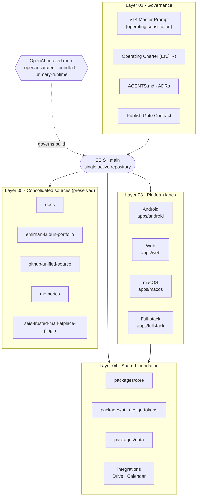

# SEIS — Platform Overview (Artifacts)

> Generated artifact set summarizing the SEIS platform: a visual architecture
> map, an ecosystem overview poster, a presentation deck, and this
> documentation page. The visual pieces were authored as fixed-canvas HTML and
> delivered both as editable Adobe Express documents and as standalone files
> (PDF / PNG).

SEIS is the single `main`-centered **closed-code** operating repository for the
`emirhankudun-ux` platform ecosystem. It coordinates Android, Web, macOS,
full-stack, data, and Google Workspace operations — plus Codex plugin
development, OpenAI-curated plugin routing, source-archive verification, and
repository consolidation — from one center.

## Architecture at a glance

## Platform lanes

| Lane | Path | Purpose |
|---|---|---|
| Android | `apps/android` | Expo / mobile direction and Android validation |
| Web | `apps/web` | Browser product surface and operating cockpit dashboards |
| macOS | `apps/macos` | Local desktop tools and SwiftUI direction |
| Full-stack | `apps/fullstack` | Convex / Supabase / Vercel backend and auth |

## Shared foundation

| Module | Path | Notes |
|---|---|---|
| Core | `packages/core` | Shared rules and platform contracts |
| UI · design-tokens | `packages/ui` | MIT open modules; `--seis-*` tokens and primitives |
| Data | `packages/data` | Inventory and analytics adapters |
| Integrations | `integrations/` | Google Drive, Calendar and external IDs |

## OpenAI-curated build route

Core work routes through OpenAI / Codex plugin families first — `openai-curated`,
`openai-bundled`, `openai-primary-runtime` — coordinated by the local
`seis@personal` plugin (repository context, migration safety, branch sync,
plugin routing).

| Category | First route |
|---|---|
| Design | Build Web Apps, Browser, Figma, Canva, MagicPath |
| Developer | GitHub, CodeRabbit, CircleCI, Cloudflare, Vercel, Supabase, Neon |
| Productivity | Drive, Calendar, Gmail, Slack, Teams, Notion |
| Research | Hugging Face, Zotero, Scite, Deepnote |
| Security | Codex Security, Sentry, Datadog, CodeRabbit, Jam |

## Maturity model

SEIS evolves through controlled levels — capability and governance harden step
by step, never speculatively:

`Lite (L1) → Standard (L2) → Professional (L3) → Enterprise (L4) → Supreme (L5)`

## Safety rules

- Closed code by default — public visibility is not open-source permission.
- OpenAI / Codex plugin families first for core build work.
- No automatic deploy.
- No direct Git commit of large binary archives.
- No source-repository deletion before verified SEIS refs and depot snapshots.
- No deletion based only on a repository being invisible or returning 404.
- Drive / Calendar records must be linked back into SEIS.
- `main` mirrors the configured default branch until repository settings change.

## Artifact set

This page is one of four artifacts produced together. The three visual pieces
were authored as self-contained fixed-canvas HTML and exported to **editable
Adobe Express documents**; standalone PDF / PNG renders were also produced and
shared out-of-band.

| Artifact | Canvas | Editable Adobe Express document |
|---|---|---|
| Platform architecture map | 1920×1080 | [open](https://new.express.adobe.com/id/urn:aaid:sc:AP:56381450-7fc2-4949-bb62-b56de7de3c60) |
| Ecosystem overview poster | A3 portrait | [open](https://new.express.adobe.com/id/urn:aaid:sc:AP:d9439e6c-90c1-4e95-a9c7-f7383472d70b) |
| Platform deck (9 slides) | 16:9 | [open](https://new.express.adobe.com/id/urn:aaid:sc:AP:041ed5d4-b817-4352-8c40-f9c7bc1147bd) |
| Platform overview (this page) | — | Markdown + Mermaid |

Visual design system: dark operational theme aligned with the SEIS design
direction (calm & compact); Adobe Fonts — Acumin Pro (display/headings),
Source Sans 3 (body), Ubuntu Mono (labels/code).

## Related canonical documents

- Operating constitution (V14): `docs/governance/seis-master-prompt-v14.md`
- Closed-code architecture: `docs/platform/seis-closed-code-architecture.md`
- Design system: `docs/design/seis-design-system.md`
- Roadmap backlog: `roadmap/seis-closed-code-backlog.md`
